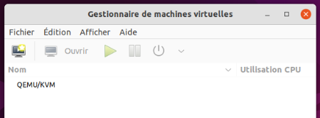
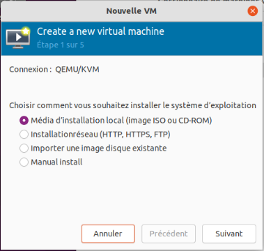
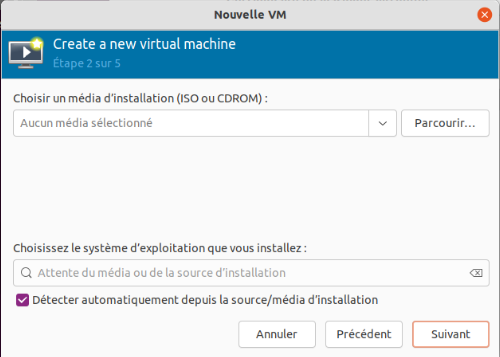
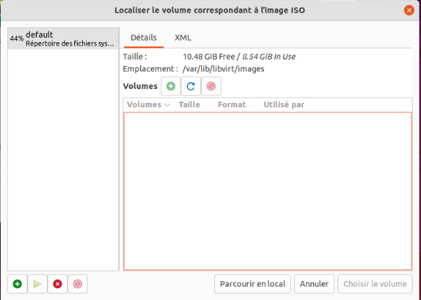
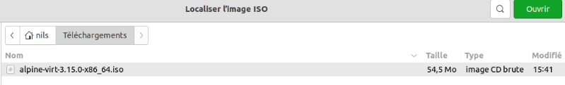
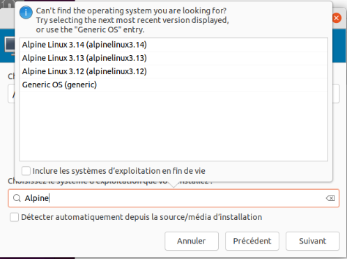
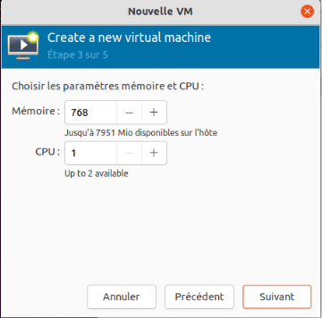
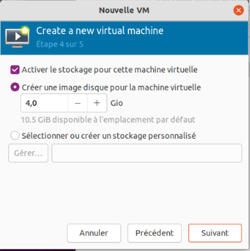
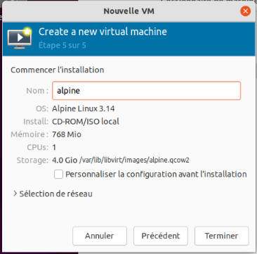

# TP 0 : installation de QEMU-KVM et de Libvirt, sur un OS Ubuntu

Objectifs :

- savoir si un ordinateur peut exécuter des machines virtuelles
- installer QEMU-KVM, Libvirt, ainsi que virt-manager
- installer une première machine virtuelle en mode graphique
- modifier quelques paramètres de la machine virtuelle en mode graphique

## Etape 0 : vérification du matériel

Pour pouvoir exécuter des machines virtuelles avec des performances
raisonnables, il faut s'assurer que le processeur dispose d'un jeu
d'instruction en particulier. Pour les processeurs Intel, il s'agit du drapeau
"vmx", et pour les processeurs AMD, il s'agit du drapeau "svm". On peut
vérifier la présence de ces drapeaux dans `/proc/cpuinfo`.

Question : est-ce que le processeur de la machine dispose du jeu d'instructions
de virtualisation ?

## Etape 1 : installation des logiciels

D'abord, mettre à jour son OS :
```
sudo apt update && sudo apt -y upgrade 
```

Ensuite, installation des paquets logiciels :
```
sudo apt -y install qemu-kvm libvirt-daemon-system libvirt-daemon virtinst libosinfo-bin virt-manager qemu-system-x86
```

Libvirt crée son propre groupe, vérifions que notre utilisateur est bien ajouté
au groupe "libvirt" :
```
grep libvirt /etc/group
```

Question : est-ce que notre utilisateur fait bien partie du groupe "libvirt" ?

Bien que les logiciels ait été installés, des modules ou des services ne sont
pas correctement démarrés. Le plus simple est de redémarrer l'ordinateur :
```
sudo reboot
```

## Etape 2 : installation d'une première machine virtuelle.
Une fois l'ordinateur redémarré, lancer l'application "Virtual Machine
Manager". Celle-ci va permettre de gérer tous les aspects des machines
virtuelles, à commencer par leur installation.



Maintenant installons notre première machine virtuelle. Pour cela nous allons
télécharger un système assez léger qui se lance sans installation : Alpine
Linux. Il s'agit d'une distribution légère et basée sur des principes de
sécurité, simplicité et efficacité des ressources.

Pour cela, se rendre sur https://alpinelinux.org/downloads/, et télécharger
l'image ISO de l'édition "virtual" pour x86_64.

Une fois que c'est fait, un fichier ayant pour nom
"alpine-virt-XXX-x86_64.iso" devrait se trouver dans le répertoire de
téléchargement.

Dans le menu "Fichier", cliquer sur "Nouvelle machine virtuelle", puis suivre
le guide.



Laisser le choix par défaut d'utiliser un média d'installation de type
ISO ou CD-ROM.



Lors du choix du média d'installation, cliquer sur "Parcour..."



Dans ce nouveau menu, cliquer sur "Parcourir en local".



Rechercher l'image ISO, qui doit se trouver dans le répertoire
"Téléchargements".



Une fois l'image sélectionnée, sélectionner le système d'exploitation en
décochant "Détecter automatiquement depuis la source/média d'installation" et
en tapant le début du nom de la distribution. Prendre la version la plus
récente, même si elle n'est pas au même niveau que la version téléchargée.



Il est possible de spécifier la quantité de mémoire vive et le nombre de
processeurs, mais laisser les paramètres par défaut pour le moment.



De même, laisser les paramètres de stockage tels quels.



Enfin, personnaliser le nom de la machine virtuelle, ici simplement "alpine". À
noter que dans ce résumé des propriétés de la machine virtuelle, lors du
changement de nom, le nom du fichier de stockage change.

Cliquer sur Terminer. Le démarrage de la machine virtuelle commence.

Pour se connecter sur l'OS invité, l'utilisateur est `root`, et il n'y a pas de
mot de passe. Attention, le clavier est configuré en QWERTY.

## Etape 3 : modification des paramètres principaux de la machine virtuelle

Eteindre la machine virtuelle, soit via la commande `poweroff`, soit via
"forcer l'extinction", qui se trouve dans le sous-menu à droite du bouton
"on/off" du menu de contrôle de la machine virtuelle.

Démarrer de nouveau la machine virtuelle.

Question : que se passe-t'il ?

Eteindre de nouveau la machine virtuelle, puis cliquer dans le menu sur le "i"
dans un disque bleu, qui permet de voir et modifier ses paramètres.

Cliquer sur "SATA CDROM 1" et ajouter de nouveau l'image ISO. Puis, dans
"Options de démarrage", faire en sorte de démarrer sur le CDROM en premier.

Démarrer de nouveau la machine virtuelle, et s'y connecter.
Lancer les commandes suivantes :
```
free -m
fdisk -l
cat /proc/cpuinfo
```

Questions :
- quelle quantité de mémoire vive y'a-t'il ?
- quelle est la taille du disque dur ?
- combien y'a-t'il de processeurs ? 
- est-ce que ces valeurs correspondent aux paramètres entrés plus tôt ?

Exercice : 
Modifier les paramètres de la machine virtuelles pour obtenir :
- 2 Go de mémoire vive
- 2 processeurs

Puis revenir aux valeurs initiales.

Pour les plus avancés, modifier les paramètres de socket/coeurs/chaines et
comparer le contenu de /proc/cpuinfo dans la machine virtuelle.

Eteindre la machine virtuelle.
